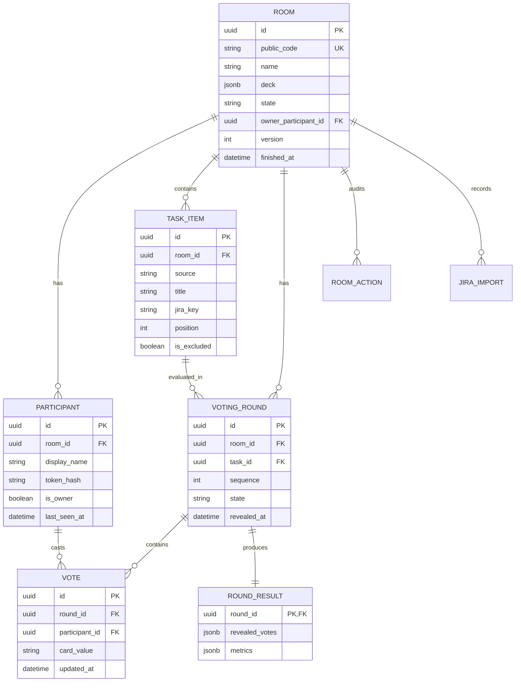

# Контракт MVP: Scrum Planning

**Статус:** утверждено для реализации.  
**Публичный адрес production:** `https://planning.giants2108.myftp.biz`.

## 1. Границы MVP

Приложение Scrum Planning проводит синхронные сессии оценки в комнатах по ссылке. Участники входят по отображаемому имени без регистрации. Jira — необязательный источник задач; ручные задачи и сессия без задач поддерживаются обязательно.

Не входят в MVP: SSO, аккаунты организаций, запись оценки обратно в Jira, экспорт CSV/XLSX/PDF, видеочат и асинхронные раунды с дедлайном.

## 2. Роли и права

| Действие | Владелец | Участник |
| --- | --- | --- |
| Войти и восстановить участие | Да | Да |
| Изменить название и колоду | Да | Нет |
| Управлять Jira-очередью задач | Да | Нет |
| Начать раунд, раскрыть карты, новый раунд, выбрать задачу | Да | Да, если online |
| Голосовать | Нет по умолчанию | Да |
| Передать владение | Да | Нет |
| Завершить сессию | Да | Нет |
| Смотреть историю и статистику | Да | Да |

Владелец участвует в room presence, но не создаёт голос. Возможность включать его в голосование — после MVP.

## 3. Состояния и конкурентное управление

```text
LOBBY ──start_round──> VOTING ──reveal──> REVEALED
  ▲                         ▲                 │
  └──── new_round / select_task ──────────────┘
                     │
                  finish
                     ▼
                 FINISHED
```

- `LOBBY`: можно настраивать комнату, задачи и запускать раунд.
- `VOTING`: можно голосовать или менять свой голос; значения карт скрыты.
- `REVEALED`: голоса и рассчитанный результат неизменяемы; можно начать следующий раунд или сменить задачу.
- `FINISHED`: только чтение истории и статистики.

Каждая изменяющая комнату команда содержит `expected_version`. Сервер исполняет её только при равенстве текущему `room.version`, затем увеличивает версию в одной транзакции. При конфликте возвращается `409 conflict` и актуальный snapshot. `reveal` идемпотентен; `start_round` и `new_round` требуют UUID `client_command_id` и идемпотентны в рамках комнаты.

## 4. Идентификация и авторизация

После первого join сервер выдаёт криптографически случайный `participant_token`. В БД хранится только хэш токена. Клиент хранит исходный токен в `localStorage` с ключом комнаты и отправляет его:

- в REST: `Authorization: Bearer <participant_token>`;
- в WebSocket: параметром `?participant_token=<participant_token>`.

Токен не логируется. Потеря токена означает новый join: совпадение имени не восстанавливает прежнего участника. Один токен в нескольких вкладках соответствует одному `participant_id` и одному голосу.

## 5. REST API

Общий префикс: `/api`. Все ответы JSON. Ошибка имеет вид:

```json
{"error": {"code": "room_version_conflict", "message": "Состояние комнаты изменилось", "details": {}}}
```

| Метод и путь | Назначение | Авторизация |
| --- | --- | --- |
| `POST /rooms` | Создать комнату и владельца | Нет |
| `GET /rooms/{code}` | Получить публичный snapshot комнаты | Нет |
| `POST /rooms/{code}/join` | Войти по имени или восстановиться по токену | Токен опционален |
| `PATCH /rooms/{code}` | Изменить название и колоду | Владелец |
| `POST /rooms/{code}/owner-transfer` | Передать владение | Владелец |
| `POST /rooms/{code}/rounds` | Начать раунд | Online-участник |
| `PUT /rooms/{code}/rounds/{round_id}/vote` | Установить или изменить свой голос | Голосующий участник |
| `POST /rooms/{code}/rounds/{round_id}/reveal` | Раскрыть карты | Online-участник |
| `POST /rooms/{code}/rounds` с `action: new_round` | Новый раунд текущей задачи | Online-участник |
| `POST /rooms/{code}/tasks` | Добавить ручную задачу | Владелец |
| `PATCH /rooms/{code}/tasks/{task_id}` | Изменить порядок/название/исключить задачу | Владелец |
| `POST /rooms/{code}/tasks/select` | Выбрать активную задачу | Online-участник |
| `POST /rooms/{code}/jira/preview` | Проверить JQL и показать задачи | Владелец |
| `POST /rooms/{code}/jira/import` | Импортировать выбранные задачи | Владелец |
| `POST /rooms/{code}/finish` | Завершить сессию | Владелец |
| `GET /rooms/{code}/history` | Получить раскрытые раунды и статистику | Участник |
| `GET /health` | Health-check приложения и БД | Нет |

Для всех управляющих запросов тело включает `expected_version`; для идемпотентных — также `client_command_id`.

### Ключевые тела запросов

```json
POST /api/rooms
{
  "name": "Оценка спринта 12",
  "owner_name": "Анна",
  "deck": {"kind": "fibonacci"}
}
```

```json
POST /api/rooms/{code}/join
{"display_name": "Иван"}
```

```json
POST /api/rooms/{code}/rounds
{
  "action": "start",
  "expected_version": 3,
  "client_command_id": "7c8958c4-0267-4c52-8e85-8f822a06ca33"
}
```

```json
PUT /api/rooms/{code}/rounds/{round_id}/vote
{"card_value": "5"}
```

```json
POST /api/rooms/{code}/rounds/{round_id}/reveal
{"expected_version": 4, "client_command_id": "8d0306e8-9ae1-4b91-8ecb-c9fce9867434"}
```

## 6. WebSocket

Путь: `wss://<domain>/ws/rooms/{code}?participant_token=<token>`.

Сервер — единственный источник истины. Клиент не рассылает голоса другим клиентам и не вычисляет итог reveal.

| Событие | Минимальная нагрузка |
| --- | --- |
| `room.snapshot` | Актуальная комната, участники, задача, раунд, версия |
| `presence.changed` | `participant_id`, `display_name`, `online`, `has_voted` |
| `round.started` | `round_id`, `task_id`, `sequence`, `started_at`, `version` |
| `vote.status_changed` | `participant_id`, `has_voted`, `version` |
| `round.revealed` | Все голоса, результат и метрики |
| `task.selected` | `task_id`, `version` |
| `room.updated` | Название, колода, настройки, версия |
| `room.finished` | Итог и read-only статус |
| `error` / `conflict` | Код, сообщение, актуальная версия |

До `round.revealed` поле `card_value` отсутствует в любом snapshot и событии для других участников. После reconnect сервер сначала отправляет `room.snapshot`.

## 7. Колоды и карты

Колода хранится упорядоченным массивом объектов `{ "value": string, "type": "numeric" | "special" }`. Значения уникальны после нормализации и ограничены 32 символами.

| Пресет | Значения |
| --- | --- |
| Fibonacci | `0, 1, 2, 3, 5, 8, 13, 21, 34, 55, 89, ?` |
| Modified Fibonacci | `0, 0.5, 1, 2, 3, 5, 8, 13, 20, 40, 100, ?` |
| Powers of two | `0, 1, 2, 4, 8, 16, 32, 64, ?` |

`numeric` должен парситься в конечное неотрицательное десятичное число. `special` включает минимум `?`, `coffee` и `skip`; специальные карты отображаются отдельно и не участвуют в числовой статистике. Пользовательская колода должна содержать хотя бы одну numeric-карту.

## 8. Аналитика раунда

Расчёт выполняется сервером единожды при reveal и сохраняется с результатом. Пусть `x` — числовые голоса, `n` — их количество.

| Показатель | Правило |
| --- | --- |
| `vote_count` | Число всех поданных голосов |
| `numeric_vote_count` | `n` |
| `mean` | `sum(x) / n` |
| `median` | Медиана отсортированного `x` |
| `min`, `max`, `range` | Минимум, максимум и `max - min` |
| `stddev` | Популяционное стандартное отклонение `sqrt(sum((x - mean)^2) / n)` |
| `coefficient_of_variation` | `stddev / mean`; `null`, если `mean = 0` |
| `mode_share` | Максимальная частота одного числового значения, делённая на `n` |
| `exact_consensus` | `true`, если `n >= 2` и все numeric-голоса равны |
| `agreement_index` | `1 - stddev / (max - min)`, ограниченный диапазоном `[0, 1]`; при `n < 2` — `null`, при `range = 0` — `1` |

При `n = 0` числовые показатели — `null`; при `n = 1` `stddev = 0`, а `agreement_index = null`. В UI обязательно отдельно показываются special-карты и причина отсутствия числовой метрики.

## 9. ERD



Ключевые ограничения: `room.public_code` уникален; `participant(room_id, token_hash)` уникален; `vote(round_id, participant_id)` уникален; в комнате существует не более одного раунда в состоянии `VOTING`.

## 10. Acceptance-сценарии MVP

| ID | Сценарий | Критерий приёмки |
| --- | --- | --- |
| AC-01 | Создание комнаты | Создатель выбирает колоду, получает уникальную ссылку и становится владельцем. |
| AC-02 | Presence | Три участника входят по ссылке; список обновляется у всех без перезагрузки. |
| AC-03 | Скрытое голосование | Участник меняет карту несколько раз; остальные видят только `has_voted`. |
| AC-04 | Reveal | Любой online-участник раскрывает карты; все получают одинаковые голоса и метрики. |
| AC-05 | История | Новый раунд очищает текущий выбор, но раскрытый результат остаётся в истории. |
| AC-06 | Повторный вход | Повторный вход с тем же токеном восстанавливает участника и не создаёт второй голос. |
| AC-07 | Конкурентность | Две одновременные команды старта создают только один раунд; второй клиент получает конфликт и snapshot. |
| AC-08 | Без задач | Сессия проходит полностью без Jira и без ручного списка задач. |
| AC-09 | Jira | JQL импортирует выбранные задачи; токен отсутствует в БД и логах. |
| AC-10 | Завершение | Только владелец завершает сессию; после этого команды изменения отклоняются, история доступна. |
| AC-11 | Reconnect | После разрыва WebSocket клиент переподключается и получает корректный актуальный snapshot. |
| AC-12 | Безопасность reveal | До reveal `card_value` отсутствует в REST и WebSocket-данных других участников. |
